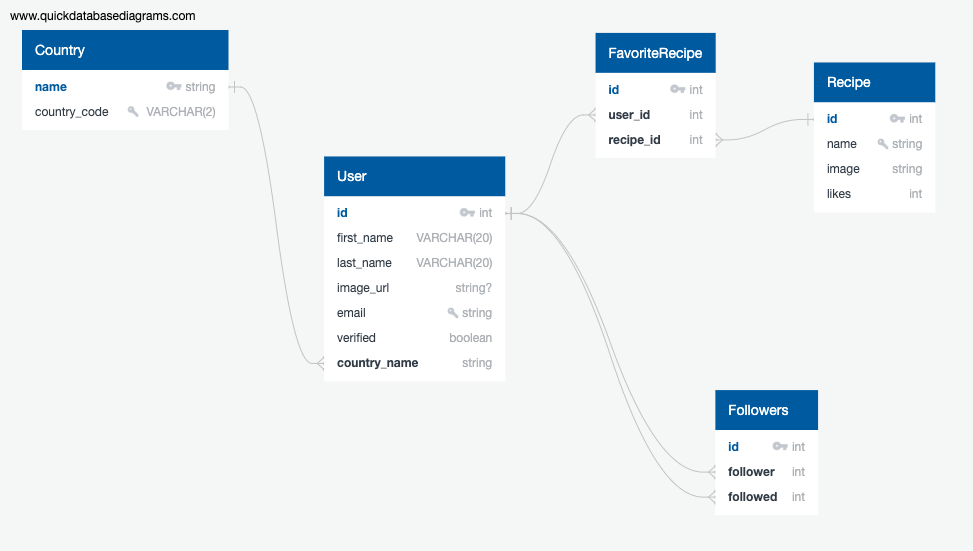

### Goal:

- Cook-it-Up's goal is to allow users to cook a delicious meal all on their own!

### Demographics

- Young professionals age 18-35 living alone

### Motivation

- prompt them to seek an easy way to cook a meal for themselves, since they have no one else to rely on.

### Functionality

- See the type of dish that they might like to eat (American, Asian, etc...) and then select that dish for steps on how to cook it.
- Find a dish based on how many calories they will want to consume.
- Get a list of required equipment once they find a recipe that they like.

- A list of ingredients will also be provided to the user when they find a recipe.

- The user should be able to <u>save their favorite</u> recipes as well.

- Users will be able to connect with other users and see their location by <u>following their profile</u>.

- As a stretch goal, users will be able to type in their ingredients and see a list of recipes that can be cooked right now.

### Technicalities:

#### API:

- [Spoonacular API](https://spoonacular.com/food-api)

#### Schema:

